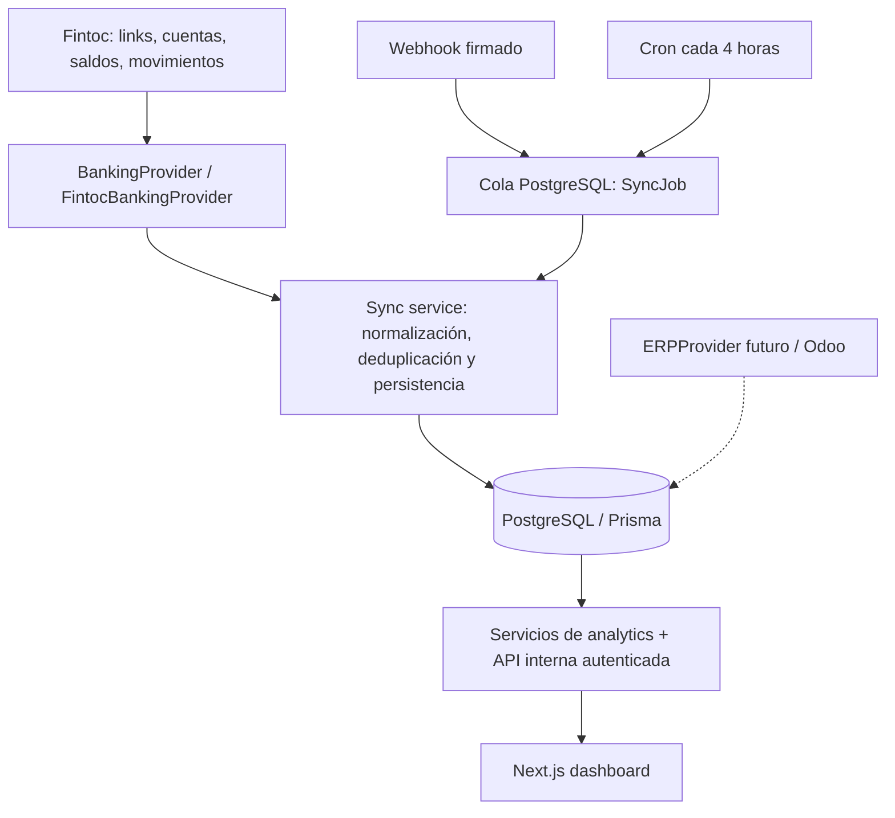

# Dashboard Bancario — Gozo

Aplicación interna de tesorería para un holding chileno. Consolida saldos por empresa y banco, consulta movimientos, analiza ingresos/egresos, registra sincronizaciones y exporta resultados a CSV. La interfaz y los cálculos usan nuestra base PostgreSQL; el navegador nunca consulta Fintoc.

**Estado:** MVP implementado y validado localmente con datos demo. Para operar con bancos reales faltan `DATABASE_URL`, `FINTOC_SECRET_KEY`, los link tokens completos y la creación del administrador del ambiente real. Los identificadores censurados entregados en el chat no se incluyeron en el código. Subir el repositorio a GitHub no despliega la aplicación.

## Arquitectura



Next.js 16, React 19, TypeScript strict, Tailwind 4, componentes locales con el patrón shadcn/Radix, Recharts, PostgreSQL y Prisma 6. Importes almacenados como `Decimal(24,0)` en la unidad mínima de cada moneda; CLP en pesos, USD en centavos. Los cálculos exactos usan SQL/Decimal/BigInt. Los gráficos convierten las agregaciones a números solo para su representación. No se suman monedas ni se realiza conversión cambiaria.

El dominio distingue Holding, Company, BankInstitution, BankConnection, BankAccount, Transaction, BalanceSnapshot, SyncRun y SyncJob. Las conexiones guardan un **nombre de variable de entorno**, nunca el token. La restricción `(bankAccountId, providerTransactionId)` y el upsert por lotes evitan duplicados y permiten corregir movimientos modificados. La categoría asignada internamente se conserva al sincronizar.

## Inicio local

Requisitos: Node.js 24, npm y PostgreSQL 17 o 18. El lockfile está incluido.

```sh
npm ci
npm run db:generate
```

### Demo aislada

En Windows x64, el helper incluido inicia PostgreSQL únicamente en loopback, puerto 55432, con una contraseña aleatoria. No instala un servicio ni modifica usuarios del sistema. En Linux/macOS puede usarse PostgreSQL propio o el helper como un usuario sin permisos root.

```sh
npm run db:local
npm run db:migrate
npm run db:demo
npm run dev
```

El helper crea `.env` con `DEMO_MODE=true` si no hay configuración previa y preserva una base local existente. Si tienes PostgreSQL propio, copia `.env.example` a `.env`, configura `DATABASE_URL`, `APP_URL=http://localhost:3000` y `DEMO_MODE=true`, y omite `db:local`.

Acceso en `demo-access.local.txt`, generado localmente con correo `demo@gozo.local` y contraseña aleatoria. El archivo y `.env` están excluidos de Git. El seed crea 9 empresas, 24 cuentas, 6 instituciones y 2.880 movimientos con saldos históricos. El seed se niega a ejecutarse si ya existe el holding o si `NODE_ENV=production`.

La demo muestra una banda permanente, exige login y bloquea sincronización bancaria. Las 23 cuentas CLP y la cuenta USD se muestran por separado. Los valores simulados no representan finanzas reales. El bootstrap real incluye 10 empresas de la lista adjunta, mientras que la demo utiliza 9 para cumplir el tamaño solicitado.

En Windows `npm run db:stop` detiene solo el PostgreSQL del directorio `.local-db`. En Linux/macOS el helper permanece en primer plano y se detiene con Ctrl+C. Para ver un build de producción local: `npm run build` y `npm start`.

## Ambiente real

### Primera conexión local con Fintoc

La copia `dashboard-gozo.html` es estática. Para consultar datos importados usa la aplicación con backend. El entorno local bancario mantiene una base `gozo_fintoc` distinta de la demo y un archivo privado `.env.fintoc.local`, excluido de Git.

```sh
npm run db:local
npm run fintoc:prepare
npm run fintoc:init
```

Completa en `.env.fintoc.local` la `FINTOC_SECRET_KEY` y los `FINTOC_LINK_*` disponibles con valores completos. No compartas el archivo. `fintoc:prepare` conserva el archivo si ya existe; la contraseña inicial de `admin@gozo.local` se genera en ese archivo. La inicialización se niega a modificar una base que ya tenga movimientos.

```sh
npm run fintoc:check
npm run fintoc:sync
npm run fintoc:start
```

Abre `http://localhost:3002`. `fintoc:check` comprueba autorización, cuentas y correspondencia del banco para cada token configurado; `fintoc:sync` persiste las conexiones configuradas y devuelve error si alguna falla. Las conexiones sin token permanecen pendientes. Los comandos no imprimen secretos ni saldos. El servidor necesita un build previo (`npm run build`), escucha solo en loopback y lee el entorno privado al iniciarse: reinícialo si cambias credenciales. Este entorno local no constituye un despliegue de producción ni configura automáticamente webhooks o un scheduler.

Usa **otra base de datos** para producción; no cambies una base demo a real.

1. Copia `.env.example` a `.env` y configura PostgreSQL administrado con TLS, `APP_URL` con el origen HTTPS exacto y `DEMO_MODE=false`.
2. Define `ADMIN_EMAIL` y `ADMIN_PASSWORD` (mínimo 14 caracteres). Ejecuta migraciones y bootstrap:

```sh
npm run db:migrate
npm run db:bootstrap
```

3. El bootstrap registra 10 empresas y 13 conexiones empresa/banco según la referencia suministrada. No inventa RUT, saldos ni cuentas. Aún debes confirmar las razones sociales y RUT antes de operación real. Es idempotente y no cambia contraseñas existentes.
4. Configura `FINTOC_SECRET_KEY` y cada variable `FINTOC_LINK_*` con el token completo correspondiente. No pegues estas credenciales en el frontend, GitHub, logs o parámetros de la URL de la aplicación.
5. Ejecuta `npm run sync` o ingresa como ADMIN a Conexiones y usa **Sincronizar ahora**. Revisa estado, error y última importación.
6. Configura el webhook y el worker recurrente descritos debajo. Confirma el primer resultado con los saldos del banco y el dashboard Fintoc antes de uso operativo.

Variables principales:

| Variable                        | Uso                                                                                    |
| ------------------------------- | -------------------------------------------------------------------------------------- |
| `DATABASE_URL`                  | PostgreSQL con acceso de aplicación y TLS en producción                                |
| `APP_URL`                       | Origen exacto; usado por redirecciones y protección CSRF                               |
| `DEMO_MODE`                     | `true` solo para el ambiente demo aislado                                              |
| `ADMIN_EMAIL`, `ADMIN_PASSWORD` | Creación inicial del administrador, solo bootstrap                                     |
| `FINTOC_SECRET_KEY`             | API key secreta de Fintoc, exclusivamente servidor                                     |
| `FINTOC_LINK_*`                 | Token completo de cada conexión, nombres en `.env.example`                             |
| `FINTOC_HISTORY_SINCE`          | Inicio de backfill; por defecto 1970-01-01 para solicitar todo el historial disponible |
| `FINTOC_WEBHOOK_SECRET`         | Secreto específico del endpoint de webhooks                                            |
| `CRON_SECRET`                   | Secreto aleatorio de al menos 32 caracteres para cron/worker                           |

La disponibilidad histórica depende del banco y Fintoc. En importaciones posteriores se usa `updated_since` con dos días de solapamiento, manteniendo la fecha inicial de backfill. Se consultan todos los estados para actualizar movimientos revertidos; solo `confirmed` participa de los reportes.

## Fintoc y sincronización

Ver [documentación de integración](docs/fintoc.md) para las referencias oficiales verificadas. La API key se envía en `Authorization` sin prefijo Bearer, según Fintoc. Los únicos endpoints de datos utilizados son `GET /v1/links`, `GET /v1/links/{link_token}` y `GET /v1/accounts/{id}/movements`. Institución, cuentas y saldos se obtienen del Link; no se inventa un endpoint de instituciones. `getConnections()` sirve para descubrimiento y **no obtiene tokens**: deben configurarse desde el contrato/dashboard existente.

`syncConnection`, `syncAccount` y `syncAllBankConnections` están en `src/services/sync.ts`. Hay exclusión concurrente con lease y fencing token, paginación hasta completar el historial, timeout de HTTP, reintentos acotados para 429/5xx, normalización y persistencia atómica por conexión. Se preserva el historial en fallos. Los movimientos se escriben en lotes de 500. Las cuentas removidas no contribuyen al saldo actual, pero conservan movimientos consultables. Cambios de `providerStatus` excluyen reversiones del flujo sin borrar registros.

`lastSuccessfulSyncAt` indica importación; `providerRefreshedAt` indica actualización bancaria real. La interfaz marca datos bancarios con más de 8 horas. No se crea un snapshot actual con un saldo viejo: la fecha del snapshot corresponde a `refreshed_at` del proveedor. La evolución consolidada requiere snapshots de todas las cuentas seleccionadas y no interpola fechas faltantes. Se muestra comparación porcentual solo cuando hay cobertura completa al inicio del período y un saldo positivo.

### Cola, cron y webhooks

`SyncJob` guarda eventos/trabajos en PostgreSQL. La recepción del webhook y el encolado son atómicos; el cuerpo completo no se almacena. Los eventos duplicados se identifican por ID. La firma HMAC SHA-256 se verifica contra el cuerpo original, con tolerancia de 5 minutos. Suscribe los eventos de links y refresh de cuentas que correspondan a tu contrato, en `https://TU_DOMINIO/api/webhooks/fintoc`.

`vercel.json` programa `/api/cron` cada 4 horas para encolar todas las conexiones y `/api/jobs` cada 10 minutos para procesar trabajos pendientes. Ambas rutas requieren `Authorization: Bearer CRON_SECRET`. Cada ejecución procesa hasta 2 conexiones; ajusta frecuencia/concurrencia para el volumen real. Las funciones tienen máximo 300 segundos. Trabajos interrumpidos se recuperan tras 20 minutos y fallos se reintentan con backoff hasta 5 intentos. Un trabajo agotado queda visible en la cola para diagnóstico y puede sustituirse por una nueva sincronización manual.

El cron frecuente necesita un plan de Vercel que lo permita o un scheduler externo. No confundir **importar datos existentes** con solicitar un refresh al banco: este MVP no llama refresh intents bajo demanda, porque dependen de la política contratada y MFA. La importación manual lee lo disponible en Fintoc.

### Deploy en Cloudflare

La configuración de Workers y OpenNext está incluida. Sigue [Cloudflare + Neon](docs/cloudflare.md) para conectar el repositorio, configurar secretos e inicializar PostgreSQL. `npm run cloudflare:build` compila el backend completo y elimina las credenciales locales del bundle; `cloudflare:preview` y `cloudflare:deploy` vuelven a comprobarlo. La creación remota de Worker/Neon y la conexión GitHub requieren acceso a esas cuentas.

### Deploy en Vercel

Importa este repositorio como proyecto Next.js con raíz en el repositorio. Configura PostgreSQL administrado y las variables exclusivamente en el servidor. Ejecuta `prisma migrate deploy` en un paso de release antes de servir tráfico; el build genera Prisma pero no modifica una base. Ejecuta bootstrap y primer sync en un entorno administrativo con la misma base/variables. Define `APP_URL` con el dominio final; las previews necesitan un origen y una base separados. No publiques los datos demo como si fueran información real.

Conecta y verifica el webhook desde el dashboard Fintoc. Verifica que cron/worker existan en el plan elegido y que haya backups y política de retención de PostgreSQL, SyncRun, SyncJob y AuditLog. No hay despliegue automático a producción configurado; GitHub Actions verifica calidad.

## Usuarios y seguridad

| Rol     | Consultar | Exportar CSV | Sincronizar manualmente |
| ------- | --------- | ------------ | ----------------------- |
| ADMIN   | Sí        | Sí           | Sí                      |
| FINANCE | Sí        | Sí           | No                      |
| VIEWER  | Sí        | No           | No                      |

Contraseñas con scrypt y salt aleatorio, sesiones opacas guardadas como hash SHA-256, cookies HttpOnly/SameSite y Secure con HTTPS, expiración a 8 horas. Todas las páginas financieras y APIs exigen usuario activo y se limitan a su holding. Mutaciones del navegador verifican el origen. El login permite hasta 8 intentos por correo cada 15 minutos usando contadores atómicos. Hay headers CSP y protección de frames, y exportación CSV con neutralización de fórmulas. No hay auto-registro ni recuperación por correo en esta iteración.

Para crear usuarios configura `NEW_USER_EMAIL`, `NEW_USER_PASSWORD`, `NEW_USER_NAME`, `NEW_USER_ROLE` (ADMIN/FINANCE/VIEWER), opcional `NEW_USER_HOLDING`, y ejecuta `npm run user:create`. No pases contraseñas como argumentos de shell. Desactiva un usuario con `User.active=false`; la siguiente petición queda bloqueada. La gestión visual de usuarios, SSO/MFA y recuperación de acceso son roadmap. Los endpoints manuales registran AuditLog. Logs del proveedor contienen solo IDs internos y errores genéricos; nunca el cuerpo de error remoto, tokens o números de cuenta completos.

## Rutas y API

UI: `/`, `/companies`, `/companies/[id]`, `/accounts`, `/accounts/[id]`, `/transactions`, `/cashflow`, `/connections`, `/settings`, `/login`.

API de lectura autenticada: `/api/dashboard`, `/api/accounts`, `/api/transactions`, `/api/transactions/export`. Comparten filtros por empresa, banco, cuenta, moneda, período, fecha contable, tipo, categoría, descripción/referencia/contraparte y monto. Las búsquedas numéricas comparan el importe absoluto. Los movimientos se paginan (30 por defecto) y el CSV se transmite en lotes de 500, sin cargar todo el historial en el navegador. No se persisten filtros financieros en localStorage.

## Estructura y ampliaciones

```text
prisma/                  schema y migración PostgreSQL
src/providers/           BankingProvider, Fintoc y contrato ERPProvider
src/services/            sync, cola, analytics, filtros, CSV y persistencia por lotes
src/lib/                 base de datos, autenticación e importes
src/components/          componentes reutilizables, gráficos y tablas
src/app/                 páginas y route handlers
scripts/                 bootstrap real, seed demo, usuarios, sync y smoke
tests/                   pruebas unitarias y de integración PostgreSQL
```

Nuevo banco Fintoc: registra BankInstitution y BankConnection vinculadas a Company, configura una variable `FINTOC_LINK_NOMBRE` y usa ese nombre como `credentialKey`. Valida que la institución del Link coincida con la conexión. El proveedor crea las cuentas al sincronizar.

Nuevo proveedor: implementa `BankingProvider`, devuelve IDs estables, importes con signo en unidades mínimas, cuentas enmascaradas y fecha de refresh real; registra el proveedor en la selección de `syncConnection`. La UI/analytics no dependen del proveedor. Global66 está preparado como MANUAL; importación CSV/Excel/API directa todavía no está implementada.

Odoo: el schema incluye ERPConnection, Invoice, AccountsReceivable, AccountsPayable, Payment y Reconciliation, y un contrato ERPProvider. No se consulta Odoo ni se calculan previsiones con información inventada. Próximos pasos: adaptador Odoo, claves externas idempotentes, documentos pendientes, conciliación y forecast por moneda a 7/30/60/90 días. AlertRule prepara reglas de saldo bajo, cuenta atrasada y egresos relevantes; el motor de alertas no está implementado.

## Validación

```sh
npm run typecheck
npm run lint
npm test
npm run test:integration
npm run build
npm audit --omit=dev
```

Integration usa únicamente PostgreSQL local en `127.0.0.1:55432` y crea un holding aislado con prefijo `integration-`; limpia solo sus registros. Verifica persistencia, idempotencia, modificaciones, totales SQL/gráficos, aislamiento de moneda/holding, filtros, preservación ante error, bloqueo concurrente y deduplicación de jobs. GitHub Actions usa PostgreSQL efímero y ejecuta estos checks.

Con demo y servidor iniciados: `npx tsx scripts/smoke.ts` comprueba login, 9 vistas, KPIs, igualdad de totales del gráfico, filtros, moneda, CSV, CSRF y bloqueo de llamadas bancarias en demo. Las credenciales se leen del archivo local y no se imprimen. La validación con una API key real y link tokens completos queda pendiente.

Ver [decisiones y límites operativos](docs/decisions.md). El lockfile contiene avisos en herramientas de desarrollo heredados de ESLint/fast-glob/braces; no tienen versión corregida disponible en la resolución actual. No se ejecutan patrones de terceros en esas herramientas. `npm audit --omit=dev` debe pasar sin vulnerabilidades; `deepmerge-ts` está fijado a 8.0.2 mediante override y el build valida compatibilidad con Prisma.
